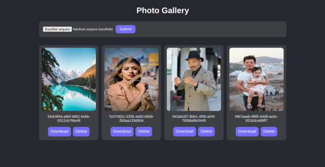
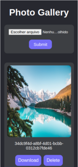

<h1 align='center'>Photo Gallery 📷</h1>

<p align="center">
  <a href="#-sobre">Sobre</a>&nbsp;&nbsp;&nbsp;|&nbsp;&nbsp;&nbsp;
  <a href="#-layout">Layout</a>&nbsp;&nbsp;&nbsp;|&nbsp;&nbsp;&nbsp;
  <a href="#-tecnologias-e-ferramentas">Tecnologias e Ferramentas</a>&nbsp;&nbsp;&nbsp;|&nbsp;&nbsp;&nbsp;
  <a href="#-funcionalidades">Funcionalidades</a>&nbsp;&nbsp;&nbsp;|&nbsp;&nbsp;&nbsp;
  <a href="#-instalação">Instalação</a>&nbsp;&nbsp;&nbsp;|&nbsp;&nbsp;&nbsp;
  <a href="#-licença">Licença</a>&nbsp;&nbsp;&nbsp;|&nbsp;&nbsp;&nbsp;
</p>

<p align="center">
    ✔ Projeto concluído
</p>

<p align="center">
    
    
    
    
    
</p>

<hr/>


## ❓ Sobre

Este projeto é uma aplicação React de galeria de fotos usando Firebase. O projeto é para fins didáticos e foi feito baseado em um tutorial do Youtube do canal [Boniek Lacerda](https://www.youtube.com/@bonieky). 


## 🎨 Layout

 


## 🛠 Tecnologias e Ferramentas

- [ReactJS](https://pt-br.reactjs.org/)
- [TypeScript](https://www.typescriptlang.org/)
- [Styled Components](https://styled-components.com/)
- [Uuid](https://www.npmjs.com/package/uuid)
- [Firebase (Storage)](https://firebase.google.com/docs/storage/web/start?hl=pt-br)
- [Vite](https://vitejs.dev/)

Veja como ficou o arquivo [package.json](./package.json) 


## ⚙ Funcionalidades 

- [x] Exibir fotos do Storage do Firebase
- [x] Fazer upload de fotos para o Storage (só são permitidos os formatos jpg, jpeg ou png)
- [x] Fazer download das fotos  
- [x] Excluir fotos


## 💻 Instalação 

Para abrir e executar o projeto no seu computador, você vai precisar ter o [Node.js](https://nodejs.org/en) instalado na sua máquina (recomendo baixar a versão LTS). Além disso, para conseguir executar os comandos de terminal a seguir, você precisará instalar o [GIT](https://git-scm.com/). 
É recomendado ter alguns conhecimentos básicos de HTML, CSS, JavaScript e React para conseguir entender os códigos do projeto e também ter alguma noção prévia de comandos de terminal para conseguir acompanhar as instruções no seu computador. 
Além disso, para o projeto funcionar na sua máquina você vai precisar configurar seu próprio Storage no Firebase. Para isso, primeiro você deve possuir uma [conta no Google](https://support.google.com/accounts/answer/27441?hl=pt-BR). Para saber como configurar seu Storage no Firebase continue acompanhando este tutorial. 
Após ter certeza de que tudo está instalado no seu computador, acompanhe os passos a seguir: 


1. Faça download do projeto ou clone ele com o seguinte comando no terminal: 

```bash 
    git clone https://github.com/Gustavo-Victor/photo-gallery.git
```
 
2. Descompacte o arquivo do projeto e abra a pasta do projeto; se tiver clonado basta só abrir a pasta do projeto; você pode abrir a pasta usando o seguinte comando: 

```bash 
    cd photo-gallery/
```

3. Instale as dependências necessárias do projeto (a pasta do projeto precisa estar aberta no terminal): 

```bash 
    npm i -g yarn ;
    yarn install ; 
```

4. Vá para a plataforma do [Firebase](https://firebase.google.com/?hl=pt), crie um projeto do Firebase e registre um app nesse projeto. Ao registrar o App no Firebase, você receberá um objeto JavaScript de configuração que servirá para conectar a aplicação aos recursos do Firebase. 
Após, isso você deve criar um Bucket padrão do Cloud Storage para poder usá-lo. 
Caso tenha dúvidas sobre como realizar os passos acima, confira alguns links que podem ajudar: 
    - [Criar projeto no Firebase](https://firebase.google.com/docs/web/setup?hl=pt-br#add-sdk-and-initialize)
    - [Configurar Bucket do Storage](https://firebase.google.com/docs/storage/web/start?hl=pt-br)

5. Renomeie o arquivo ".env.example" para ".env.local" sem as aspas. Após isso, copie os valores das propriedades do objeto de configuração do seu projeto no Firebase e cole esses valores nos campos em branco das variáveis de ambiente do arquivo ".env.local". 

6. Execute o projeto em modo de desenvolvimento: 

```bash 
    yarn dev 
```

7. Abra o projeto em seu navegador de preferência. (Basta digitar na barra de pesquisa: http://localhost:5173/). 


<hr/>

## 📝 Licença 

O projeto está sob a Licensa MIT 

Qualquer pessoa pode usar, clonar e contribuir com este projeto. 

Clique [aqui](./LICENSE) para saber mais  


